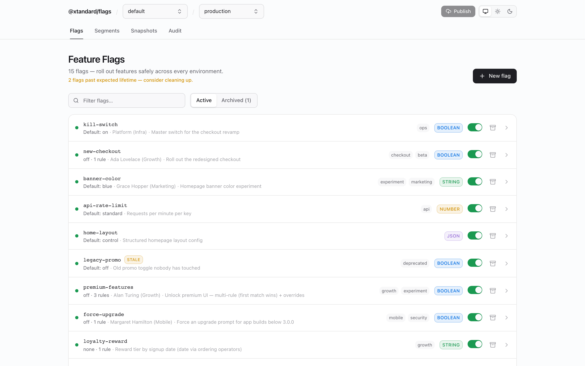

# `@xtandard/flags`

> Self-hosted, embeddable, **OpenFeature**-compatible feature-flag control plane
> with pluggable storage and **memory-first** runtime evaluation.

Run it standalone, mount it inside your existing app (Elysia/Hono/Bun/…), or use
its OpenFeature provider directly. Applications evaluate flags **from memory**, so
the admin panel is never in the request path.

```txt
The admin/control plane can be down — and your applications keep evaluating flags.
```



## Why another flag tool?

Unleash / Flagsmith / GO Feature Flag are great, but most assume a server in (or
near) the request path and a heavier deployment. `@xtandard/flags` owns a narrow,
sharp gap:

- **Self-hosted OpenFeature admin** + **pluggable storage** + **local-first
  evaluation** + **embeddable/standalone** deployment.
- A single npm package with explicit subpath exports and optional peer deps.
- Bundled admin SPA — consumers mounting the panel **don't install React**.
- A tiny, zero-dependency evaluator and provider in the request path.

It is intentionally _not_ a LaunchDarkly clone: no experiment analytics, no hosted
SaaS, no mandatory Redis/Postgres/auth. Batteries included, **not** required —
everything official is just an implementation of a public contract you can replace.

## Install

```bash
bun add @xtandard/flags
# optional integrations (peer deps), install what you use:
bun add redis unstorage pg mongodb @openfeature/server-sdk elysia hono express
```

## The two planes

| Plane                     | What                 | Reads/Writes                                                                                                   |
| ------------------------- | -------------------- | -------------------------------------------------------------------------------------------------------------- |
| **Admin / control plane** | UI + JSON API + CLI  | reads/writes **source storage**; compiles immutable snapshots; publishes to **runtime storage**                |
| **Application runtime**   | OpenFeature provider | loads a whole **snapshot** from runtime storage into memory; evaluates in-process; refreshes in the background |

```ts
type FlagsPanelOptions = {
  sourceStorage: FlagsStorage; // canonical: drafts, history, audit
  runtimeStorage?: FlagsStorage; // published snapshots (default = sourceStorage)
};
```

## Embed the admin panel (Elysia)

```ts
import { Elysia } from "elysia";
import { flagsPanel } from "@xtandard/flags/elysia";
import { createRedisStorage } from "@xtandard/flags/storage/redis";
import { basicAuth } from "@xtandard/flags/auth/basic";

new Elysia()
  .mount(
    "/flags",
    flagsPanel({
      basePath: "/flags",
      sourceStorage: createRedisStorage({
        url: process.env.REDIS_URL!,
        prefix: "xtandard:flags:source",
      }),
      runtimeStorage: createRedisStorage({
        url: process.env.REDIS_URL!,
        prefix: "xtandard:flags:runtime",
      }),
      auth: basicAuth({
        users: [{ username: "admin", passwordHash: process.env.FLAGS_ADMIN_PASSWORD_HASH! }],
      }),
    }),
  )
  .listen(3000);
```

## Embed the admin panel (Hono)

```ts
import { Hono } from "hono";
import { flagsPanel } from "@xtandard/flags/hono";
import { createUnstorageStorage } from "@xtandard/flags/storage/unstorage";
import { createStorage } from "unstorage";

const app = new Hono();
app.route(
  "/flags",
  flagsPanel({
    basePath: "/flags",
    sourceStorage: createUnstorageStorage({ storage: createStorage() }),
  }),
);
export default app;
```

## Standalone (Docker)

```bash
docker run --rm -p 3000:3000 \
  -e SOURCE_STORAGE_DRIVER=redis -e RUNTIME_STORAGE_DRIVER=redis \
  -e REDIS_URL=redis://host.docker.internal:6379 \
  -e AUTH_MODE=basic -e AUTH_USERNAME=admin -e AUTH_PASSWORD_HASH='scrypt$...' \
  ghcr.io/xantiagoma/xtandard-flags:latest
```

Visit `http://localhost:3000`. Health check at `/healthcheck`.

## Evaluate flags at runtime (OpenFeature)

```ts
import { OpenFeature } from "@openfeature/server-sdk";
import { createOpenFeatureProvider } from "@xtandard/flags/openfeature";
import { createRedisStorage } from "@xtandard/flags/storage/redis";

OpenFeature.setProvider(
  createOpenFeatureProvider({
    projectKey: "default",
    environmentKey: "production",
    storage: createRedisStorage({ url: process.env.REDIS_URL!, prefix: "xtandard:flags:runtime" }),
    refreshIntervalMs: 10_000,
  }),
);

const client = OpenFeature.getClient();
const theme = await client.getStringValue("theme", "normal", {
  targetingKey: user.id,
  country: user.country,
  plan: user.plan,
});
```

After the first load the provider serves **from memory**. If the admin panel goes
away, evaluation is unaffected. If storage goes down _after_ the first load, the
provider keeps serving the **last-known-good** snapshot (marked `stale`). Missing
flags return the caller's default with `FLAG_NOT_FOUND`.

## Flag model

Every flag — even boolean — is variant-based. Evaluation order:

1. **Disabled** → default variant (`DISABLED`)
2. **Exact override** on the bucketing key (`STATIC`)
3. **Targeting rules**, first match wins (`TARGETING_MATCH` / `SPLIT`)
4. **Fallthrough** — fixed variant or deterministic weighted split (`STATIC` / `SPLIT`)
5. Invalid config → caller default (`ERROR`); missing flag → caller default (`FLAG_NOT_FOUND`)

Splits are deterministic: `same flagKey + same targetingKey + same salt → same variant`
(MurmurHash3, never `Math.random`). Weights need not total 100.

## Bring your own everything

```ts
import type { FlagsStorage } from "@xtandard/flags";
const myStorage: FlagsStorage = {
  getItem: (k) => db.get(k),
  setItem: (k, v) => db.set(k, v),
  removeItem: (k) => db.delete(k),
  getKeys: (prefix) => db.keys(prefix),
};
```

Same story for `AuthProvider` and `AuthorizationProvider` — the built-ins
(`auth/none|basic|delegated`, `authorization/none|roles|delegated`) are just
implementations of public contracts.

## Subpath exports

| Import                                                                          | What                                                                     |
| ------------------------------------------------------------------------------- | ------------------------------------------------------------------------ |
| `@xtandard/flags`                                                               | core types, evaluator, snapshot, `createFlagsCore`, `createFetchHandler` |
| `@xtandard/flags/openfeature`                                                   | OpenFeature provider                                                     |
| `@xtandard/flags/storage/{memory,file,redis,unstorage,postgres,mongodb,sqlite}` | storage adapters                                                         |
| `@xtandard/flags/auth/{none,basic,delegated}`                                   | auth providers                                                           |
| `@xtandard/flags/authorization/{none,roles,delegated}`                          | authorization providers                                                  |
| `@xtandard/flags/{elysia,hono,bun,express}`                                     | framework adapters                                                       |
| `@xtandard/flags/testing`                                                       | in-memory panel + flag builders                                          |

## CLI

```bash
xtandard-flags init        # create default project/env + empty draft
xtandard-flags list        # list flags in the draft
xtandard-flags validate    # validate the draft (exit 1 if invalid)
xtandard-flags publish     # compile draft → snapshot → activate
xtandard-flags rollback v3 # re-point active version
xtandard-flags inspect     # print the active snapshot
```

## Docs

- [Architecture](docs/ARCHITECTURE.md) · [Getting started](docs/GETTING_STARTED.md)
- [Storage](docs/STORAGE.md) · [Auth](docs/AUTH.md) · [Authorization](docs/AUTHORIZATION.md)
- [OpenFeature](docs/OPENFEATURE.md) · [UI](docs/UI.md) · [Adapters](docs/ADAPTERS.md)
- [Deployment](docs/DEPLOYMENT.md) · [Testing](docs/TESTING.md) · [Releases](docs/RELEASES.md)
- ADRs in [docs/ADR](docs/ADR/)

## Project status

Early but functional (`v0.1`). The headless runtime (evaluator, snapshots,
provider, storage), admin API, auth/authz, framework adapters, bundled UI,
standalone Docker app, and CLI are implemented and tested. APIs may still shift
before `1.0`.

## License

MIT © Santiago Montoya
