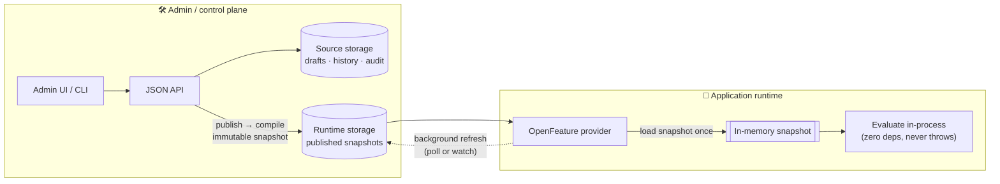
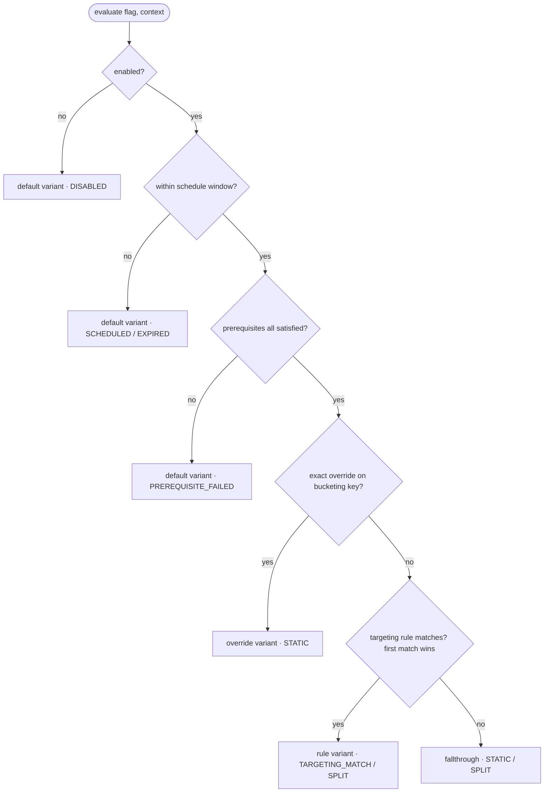

<p align="center">
  
</p>

<h1 align="center">@xtandard/flags</h1>

<p align="center">
  <strong>Self-hosted, embeddable, <a href="https://openfeature.dev">OpenFeature</a>-compatible feature-flag control plane</strong><br/>
  with pluggable storage and <strong>memory-first</strong> runtime evaluation.
</p>

<p align="center">
  <a href="https://www.npmjs.com/package/@xtandard/flags"></a>
  <a href="https://www.npmjs.com/package/@xtandard/flags"></a>
  <a href="https://github.com/xantiagoma/xtandard-flags/actions/workflows/ci.yml"></a>
  <a href="https://github.com/xantiagoma/xtandard-flags/blob/main/LICENSE"></a>
  
</p>

<p align="center">
  Run it <strong>standalone</strong>, <strong>embed</strong> it inside your existing app (Elysia / Hono / Express / Bun / Next.js), or use its <strong>OpenFeature provider</strong> directly.<br/>
  Applications evaluate flags <strong>from memory</strong> — the admin panel is never in the request path.
</p>

<p align="center">
  
</p>

> **The control plane can be down — and your applications keep evaluating flags.**
> After the first load, evaluation is fully in-process; if storage drops afterward,
> the provider serves the **last-known-good** snapshot (marked `stale`).

---

## Contents

- [Why another flag tool?](#why-another-flag-tool)
- [How it works — the two planes](#how-it-works--the-two-planes)
- [Quickstart](#quickstart)
- [Evaluate flags at runtime (OpenFeature)](#evaluate-flags-at-runtime-openfeature)
- [The flag model](#the-flag-model)
- [Storage backends](#storage-backends)
- [Subpath exports](#subpath-exports)
- [Examples](#examples)
- [Screenshots](#screenshots)
- [CLI](#cli)
- [Docs](#docs)

## Why another flag tool?

Unleash / Flagsmith / GO Feature Flag are great, but most assume a server in (or
near) the request path and a heavier deployment. `@xtandard/flags` owns a narrow,
sharp gap:

- 🏠 **Self-hosted OpenFeature admin** — your data, your infra, no SaaS.
- 🔌 **Pluggable storage** — memory, file, Redis, Postgres, MongoDB, SQLite, **libSQL/Turso**, **Cloudflare KV**, or any [unstorage](https://unstorage.unjs.io) driver. Bring your own with four methods.
- ⚡ **Local-first evaluation** — a tiny, **zero-dependency** evaluator + provider run in-process (JS/TS). The panel can be offline.
- 🌐 **Any language, standard protocol** — every other language evaluates over **OFREP** (the OpenFeature Remote Evaluation Protocol): point any OpenFeature SDK's generic OFREP provider at the panel — no vendor SDK to write or install.
- 🧩 **Embeddable or standalone** — mount the panel in your app, or run the Docker image.
- 📦 **One npm package** — explicit subpath exports, optional peer deps; install only what you use.
- 🎛️ **Bundled admin SPA** — consumers mounting the panel **don't install React**.

It is intentionally _not_ a LaunchDarkly clone: no experiment analytics, no hosted
SaaS, no mandatory Redis/Postgres/auth. Batteries included, **not** required —
everything official is just an implementation of a public contract you can replace.

## How it works — the two planes



| Plane                     | What                 | Reads / writes                                                                                  |
| ------------------------- | -------------------- | ----------------------------------------------------------------------------------------------- |
| **Admin / control plane** | UI + JSON API + CLI  | reads/writes **source storage**; compiles immutable snapshots; publishes to **runtime storage** |
| **Application runtime**   | OpenFeature provider | loads a whole **snapshot** into memory; evaluates in-process; refreshes in the background       |

```ts
type FlagsPanelOptions = {
  sourceStorage: FlagsStorage; // canonical: drafts, history, audit
  runtimeStorage?: FlagsStorage; // published snapshots (default = sourceStorage)
};
```

See [ADR 0002 — memory-first runtime evaluation](docs/ADR/0002-memory-first-runtime-evaluation.md).

## Quickstart

### Install

```bash
bun add @xtandard/flags
# optional integrations (peer deps) — install only what you use:
bun add redis pg mongodb @libsql/client unstorage @openfeature/server-sdk elysia hono express
```

### Run the standalone (Docker)

```bash
docker run --rm -p 3000:3000 \
  -e SOURCE_STORAGE_DRIVER=redis -e RUNTIME_STORAGE_DRIVER=redis \
  -e REDIS_URL=redis://host.docker.internal:6379 \
  -e AUTH_MODE=basic -e AUTH_USERNAME=admin -e AUTH_PASSWORD_HASH='scrypt$...' \
  ghcr.io/xantiagoma/xtandard-flags:latest
```

Visit `http://localhost:3000`. Health check at `/healthcheck`.

Configured entirely by env vars — `PORT`, `BASE_PATH`, `TITLE`, `LOGO_URL`,
`READONLY`, `STREAMING` (OFREP SSE), `AUTH_MODE`/`AUTH_USERNAME`/`AUTH_PASSWORD[_HASH]`,
and the `SOURCE_/RUNTIME_STORAGE_DRIVER` family (`memory`/`file`/`redis`/`postgres`/
`mongodb`/`sqlite`/`unstorage`). **Full reference + per-driver vars:**
[docs/DEPLOYMENT.md](docs/DEPLOYMENT.md). The same set works with `serve` (run
`npx @xtandard/flags serve --help`).

### Or run it without Docker (`npx` / `bunx`)

Same server, same env vars — no container:

```bash
PORT=4000 \
  SOURCE_STORAGE_DRIVER=redis RUNTIME_STORAGE_DRIVER=redis \
  REDIS_URL=redis://localhost:6379 \
  AUTH_MODE=basic AUTH_USERNAME=admin AUTH_PASSWORD=secret \
  npx @xtandard/flags serve          # or: bunx @xtandard/flags serve
```

`serve` runs under both Node (`npx`) and Bun (`bunx`). With no env it defaults to
**file** storage under `./.flags/` in the current directory (a `source/` and a
`runtime/` subdir) and no auth — fine for a quick local look. It prints the
resolved storage paths on startup; set an absolute `SOURCE_FILE_DIR` /
`RUNTIME_FILE_DIR` (or a different driver) to persist elsewhere, and set
`AUTH_MODE=basic` before exposing it.

### Or embed the admin panel in your app

<details open>
<summary><strong>Elysia</strong></summary>

```ts
import { Elysia } from "elysia";
import { flagsPanel } from "@xtandard/flags/elysia";
import { createRedisStorage } from "@xtandard/flags/storage/redis";
import { basicAuth } from "@xtandard/flags/auth/basic";

new Elysia()
  .mount(
    "/flags",
    flagsPanel({
      basePath: "/flags",
      sourceStorage: createRedisStorage({ url: process.env.REDIS_URL!, prefix: "flags:source" }),
      runtimeStorage: createRedisStorage({ url: process.env.REDIS_URL!, prefix: "flags:runtime" }),
      auth: basicAuth({
        users: [{ username: "admin", passwordHash: process.env.FLAGS_ADMIN_PASSWORD_HASH! }],
      }),
    }),
  )
  .listen(3000);
```

</details>

<details>
<summary><strong>Hono</strong></summary>

```ts
import { Hono } from "hono";
import { flagsPanel } from "@xtandard/flags/hono";
import { createUnstorageStorage } from "@xtandard/flags/storage/unstorage";
import { createStorage } from "unstorage";

const app = new Hono();
app.route(
  "/flags",
  flagsPanel({
    basePath: "/flags",
    sourceStorage: createUnstorageStorage({ storage: createStorage() }),
  }),
);
export default app;
```

</details>

<details>
<summary><strong>Express</strong></summary>

```ts
import express from "express";
import { flagsPanel } from "@xtandard/flags/express";
import { createFileStorage } from "@xtandard/flags/storage/file";

const app = express();
// Mount the panel BEFORE body-parsing middleware — it reads the raw body.
app.use(
  "/flags",
  flagsPanel({ basePath: "/flags", sourceStorage: createFileStorage({ dir: "./.flags" }) }),
);
app.listen(3000);
```

</details>

Then open `http://localhost:3000/flags`, create a flag, and **Publish**.

## Evaluate flags at runtime (OpenFeature)

Two ways, both standard OpenFeature — pick by language:

| Path                                  | For              | Eval runs                    | Resilience                                                           |
| ------------------------------------- | ---------------- | ---------------------------- | -------------------------------------------------------------------- |
| **In-process provider** (recommended) | JS / TS          | inside your app, from memory | control plane down → fine; storage down after load → last-known-good |
| **OFREP** (remote)                    | **any** language | on the server, over HTTP     | run the standalone next to your app + ETag/304 caching               |

### In-process — JS/TS, memory-first (recommended)

```ts
import { OpenFeature } from "@openfeature/server-sdk";
import { createOpenFeatureProvider } from "@xtandard/flags/openfeature";
import { createRedisStorage } from "@xtandard/flags/storage/redis";

OpenFeature.setProvider(
  createOpenFeatureProvider({
    projectKey: "default",
    environmentKey: "production",
    storage: createRedisStorage({ url: process.env.REDIS_URL!, prefix: "flags:runtime" }),
    refreshIntervalMs: 10_000,
  }),
);

const client = OpenFeature.getClient();
const theme = await client.getStringValue("theme", "normal", {
  targetingKey: user.id,
  country: user.country,
  plan: user.plan,
});
```

After the first load the provider serves **from memory**. If the admin panel goes
away, evaluation is unaffected. If storage goes down _after_ the first load, the
provider keeps serving the **last-known-good** snapshot (marked `stale`). Missing
flags return the caller's default with `FLAG_NOT_FOUND`. The evaluator is pure and
never throws — invalid config falls back to the caller default with `ERROR`. **This
is the path to use for JS/TS services.**

### Any language — OFREP (remote evaluation)

Go, Python, Rust, Java, .NET, … evaluate over **OFREP**, the OpenFeature Remote
Evaluation Protocol — a standard HTTP contract. Point any OpenFeature SDK's generic
OFREP provider at your panel; there's no vendor library to write or install.

```python
# pip install openfeature-sdk openfeature-provider-ofrep
from openfeature import api
from openfeature.contrib.provider.ofrep import OFREPProvider

api.set_provider(OFREPProvider(base_url="https://flags.example.com"))
enabled = api.get_client().get_boolean_value("new-checkout", False, ctx)
```

The panel serves OFREP bulk + single evaluation with `ETag`/`304` caching and an
opt-in SSE stream for live updates. Runnable clients (Python / Go / plain TS) are
in [`examples/ofrep-clients`](examples/ofrep-clients) (`bun run examples:ofrep-clients`);
full details in [docs/OPENFEATURE.md](docs/OPENFEATURE.md#remote-evaluation-ofrep).

> **Which should I use?** For JS/TS, prefer the in-process provider above — it's
> memory-first and keeps working if the control plane is down. OFREP puts the
> server in the request path, so for the same resilience run the standalone server
> next to your app and lean on ETag/304 caching.

## The flag model

Every flag — even boolean — is variant-based. Evaluation is a deterministic
order; the **first** thing that resolves wins:



- **Splits are deterministic**: `same flagKey + same targetingKey + same salt → same variant` (MurmurHash3, never `Math.random`). Weights need not total 100.
- **Targeting rules** are **conditions** combined with **AND / OR / NOT groups** (nest arbitrarily; a flat list is a plain AND). Operators cover equality, membership, string, numeric, **dates** (ISO-8601 / epoch / `Date` / `Temporal` via ordering operators), **semver**, **`inSegment` / `notInSegment`**, and **`matches` / `notMatches`** — a JSON query document evaluated by a pluggable matcher (built-in `regex`, or `sift` / `mingo` via a [registered matcher](docs/OPERATORS.md#query-matchers-matches--notmatches)).
- **Value objects** are understood out of the box for ordering/equality (the whole Temporal family + `BigInt`); for types that don't follow that convention — Dinero, Decimal — register a [**custom comparator**](docs/OPERATORS.md#custom-comparators).
- **Reusable segments** are named audiences referenced by rules; **prerequisites** express flag-to-flag dependencies (acyclic, validated at publish).
- **Scheduled active window** (`schedule.enableAt` / `disableAt`) — outside it the evaluator serves the default variant (`SCHEDULED` / `EXPIRED`); behavioral, checked live, never flips `enabled`.
- **Organizational metadata**: tags, owner, archiving (excluded from snapshots), and advisory **stale detection** (a `lifecycle` policy that only shows a badge — it never changes behavior).

Full reference: [docs/OPERATORS.md](docs/OPERATORS.md).

## Storage backends

One four-method contract; pick the backend per plane (a common split is a durable
**source** and a fast, close-to-the-app **runtime**).

| Backend           | Import                                  | Runtime    | Best for                                            |
| ----------------- | --------------------------------------- | ---------- | --------------------------------------------------- |
| Memory            | `@xtandard/flags/storage/memory`        | any        | tests, single-process experiments                   |
| File              | `@xtandard/flags/storage/file`          | any        | local dev, GitOps drafts in VCS                     |
| Redis             | `@xtandard/flags/storage/redis`         | any        | multi-node, push-based refresh (`watch`)            |
| Postgres          | `@xtandard/flags/storage/postgres`      | any        | durable, transactional source                       |
| MongoDB           | `@xtandard/flags/storage/mongodb`       | any        | you already run Mongo                               |
| SQLite            | `@xtandard/flags/storage/sqlite`        | **Bun**    | single-node persistence, zero deps                  |
| **libSQL/Turso**  | `@xtandard/flags/storage/libsql`        | any / edge | edge-replicated runtime, serverless SQLite          |
| **Cloudflare KV** | `@xtandard/flags/storage/cloudflare-kv` | Workers    | runtime snapshots inside Cloudflare Workers         |
| Anything else     | `@xtandard/flags/storage/unstorage`     | any        | 20+ drivers (Upstash, Vercel KV, S3/R2, Netlify, …) |

```ts
// Bring your own — any object with these four methods is valid storage:
import type { FlagsStorage } from "@xtandard/flags";
const myStorage: FlagsStorage = {
  getItem: (k) => db.get(k),
  setItem: (k, v) => db.set(k, v),
  removeItem: (k) => db.delete(k),
  getKeys: (prefix) => db.keys(prefix),
};
```

Same story for `AuthProvider` and `AuthorizationProvider` — the built-ins
(`auth/none|basic|delegated`, `authorization/none|roles|delegated`) are just
implementations of public contracts. See [docs/STORAGE.md](docs/STORAGE.md).

## Subpath exports

| Import                                                                                               | What                                                                     |
| ---------------------------------------------------------------------------------------------------- | ------------------------------------------------------------------------ |
| `@xtandard/flags`                                                                                    | core types, evaluator, snapshot, `createFlagsCore`, `createFetchHandler` |
| `@xtandard/flags/openfeature`                                                                        | OpenFeature provider                                                     |
| `@xtandard/flags/storage/{memory,file,redis,unstorage,postgres,mongodb,sqlite,libsql,cloudflare-kv}` | storage adapters                                                         |
| `@xtandard/flags/match/sift`                                                                         | sift query matcher for `matches` / `notMatches`                          |
| `@xtandard/flags/hooks/{webhook,log,test-gate}`                                                      | bundled control-plane hooks (webhook, log, publish test-gate)            |
| `@xtandard/flags/auth/{none,basic,delegated}`                                                        | auth providers                                                           |
| `@xtandard/flags/authorization/{none,roles,delegated}`                                               | authorization providers                                                  |
| `@xtandard/flags/{elysia,hono,bun,express}`                                                          | framework adapters                                                       |
| `@xtandard/flags/react`                                                                              | embeddable `<FlagsDashboard/>` component (advanced; React peer)          |
| `@xtandard/flags/testing`                                                                            | in-memory panel + flag builders                                          |

## Examples

Runnable mini-projects in [`examples/`](examples/) — each mounts the panel **and**
shows flags driving real behavior (change a flag, publish, watch the app change):

| Example                                            | Shows                                                                |
| -------------------------------------------------- | -------------------------------------------------------------------- |
| [`elysia/`](examples/elysia)                       | Mount the panel + a route whose response a flag controls.            |
| [`hono/`](examples/hono)                           | Same, on Hono.                                                       |
| [`express/`](examples/express)                     | Same, on Express.                                                    |
| [`auth/`](examples/auth)                           | Auth + RBAC flexibility: none/basic/header/cookie/JWT/query.         |
| [`flags-sdk/`](examples/flags-sdk)                 | Next.js + Vercel Flags SDK; panel mounted + a home page flags drive. |
| [`openfeature-redis/`](examples/openfeature-redis) | Evaluate at runtime via the OpenFeature provider over Redis.         |
| [`ofrep/`](examples/ofrep)                         | Remote eval via **OFREP** over HTTP — bulk/single, ETag/304, SSE.    |
| [`ofrep-clients/`](examples/ofrep-clients)         | Consume flags from **Python, Go, plain TS** via OpenFeature + OFREP. |
| [`storage-drivers/`](examples/storage-drivers)     | One contract, every backend.                                         |
| [`react-embed/`](examples/react-embed)             | Embed `<FlagsDashboard/>` in an existing React app.                  |
| [`standalone-docker/`](examples/standalone-docker) | The Docker image + Redis via `docker compose`.                       |

```bash
bun run build               # build dist/ + dist/ui once
bun run examples:elysia     # → ▶ elysia → http://localhost:NNNN/flags
```

## Screenshots

|                                                                                                                   |                                                                                                                                |
| ----------------------------------------------------------------------------------------------------------------- | ------------------------------------------------------------------------------------------------------------------------------ |
|         |  |
| **Flag editor** — variants, rules, query targeting                                                                | **Snapshots** — immutable versions, download/import JSON                                                                       |
|  |                        |
| **Publish** — git-style diff of unpublished changes                                                               | **Audit** — per-version diff of every change                                                                                   |

## CLI

```bash
xtandard-flags serve       # run the panel + API server (no Docker; honors the env vars above)
xtandard-flags init        # create default project/env + empty draft
xtandard-flags list        # list flags in the draft
xtandard-flags validate    # validate the draft (exit 1 if invalid)
xtandard-flags publish     # compile draft → snapshot → activate
xtandard-flags rollback v3 # re-point active version
xtandard-flags inspect     # print the active snapshot
```

Run any command via `npx @xtandard/flags <cmd>` or `bunx @xtandard/flags <cmd>`
without installing.

## Docs

- [Architecture](docs/ARCHITECTURE.md) · [Getting started](docs/GETTING_STARTED.md)
- [Storage](docs/STORAGE.md) · [Auth](docs/AUTH.md) · [Authorization](docs/AUTHORIZATION.md) · [Hooks](docs/HOOKS.md)
- [OpenFeature](docs/OPENFEATURE.md) · [UI](docs/UI.md) · [Operators](docs/OPERATORS.md) · [Adapters](docs/ADAPTERS.md)
- [Deployment](docs/DEPLOYMENT.md) · [Testing](docs/TESTING.md) · [Releases](docs/RELEASES.md)
- ADRs in [docs/ADR](docs/ADR/)
- **API reference** (TSDoc): `bun run docs:api` → generates `docs/api` (TypeDoc).

## Project status

Functional and tested (`v0.x`). The headless runtime (evaluator, snapshots,
provider, storage), admin API, auth/authz, framework adapters, bundled UI,
standalone Docker app, and CLI are all implemented and covered by tests.

Versioning follows [**ZeroVer**](https://0ver.org): the major stays at `0`
indefinitely (no planned `1.0`). Within `0.x`, a **minor** bump (`0.x.0`) may
carry breaking changes and a **patch** (`0.x.y`) is fixes + additive changes —
so pin with `^0.x.y`. See [docs/RELEASES.md](docs/RELEASES.md).

## License

MIT © Santiago Montoya
