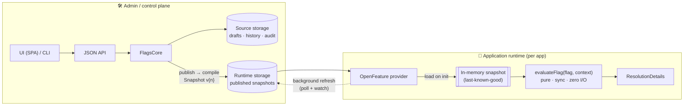
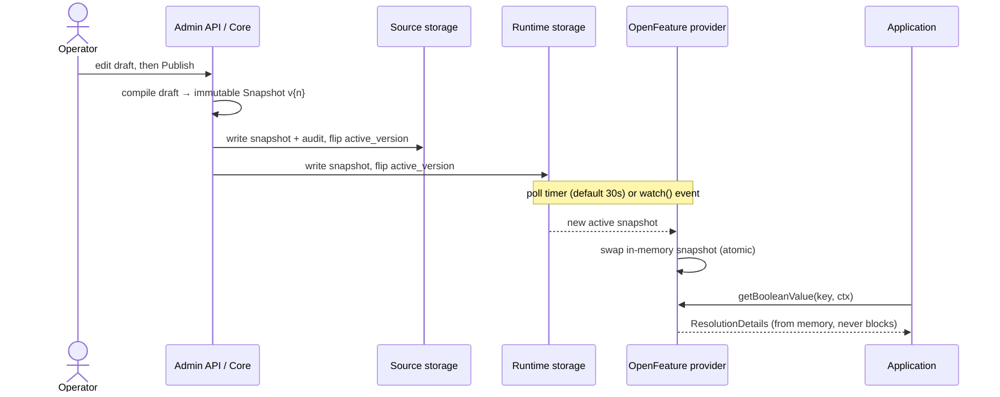
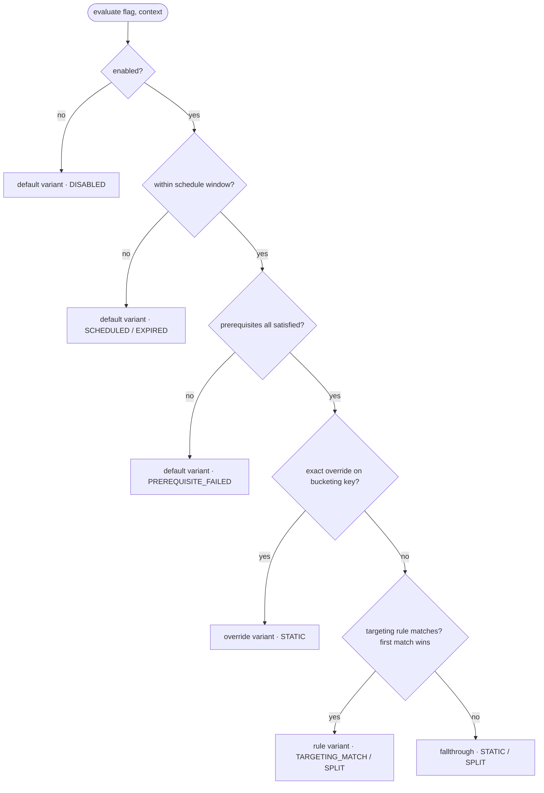

# Architecture

`@xtandard/flags` is built around one invariant: **application flag evaluation must never depend on the admin panel being available.** This drives every structural decision.

---

## The Two Planes



### Admin plane

The admin plane is the UI, the JSON API, and the CLI. It reads and writes **source storage** — the canonical store that holds drafts, the full snapshot history, and the audit log. When an operator publishes, the core:

1. Compiles the draft into an immutable, versioned `Snapshot`.
2. Writes the snapshot to **both** source storage and runtime storage.
3. Flips the `active_version` pointer in both stores.

Rollback re-points `active_version` without recompiling. The admin plane is never in the request path of an application.

### Application runtime

The OpenFeature provider loads the active snapshot from runtime storage into memory at startup (`initialize`), then keeps it fresh via:

- A background polling timer (default every 30 s).
- A storage `watch` subscription, if the storage adapter is `WatchableFlagsStorage` (Redis, memory, file).

All flag resolution reads only the in-memory snapshot — it is pure, synchronous, and cannot fail because storage is unavailable.

### Publish → propagate → evaluate



If runtime storage is unreachable when the refresh fires, the provider keeps the
previous snapshot and marks it `stale` — evaluation never blocks or throws.

---

## Source vs Runtime Storage

| Store       | Holds                                                          | Written by                   | Read by              |
| ----------- | -------------------------------------------------------------- | ---------------------------- | -------------------- |
| **Source**  | Drafts, full snapshot history, audit log, project/env metadata | Admin (write), CLI (write)   | Admin panel, CLI     |
| **Runtime** | Published snapshots only (active + history for rollback)       | Admin `publish` / `rollback` | OpenFeature provider |

In the simplest deployment, source and runtime storage are the **same** storage instance (the `runtimeStorage` option defaults to `sourceStorage`). For production deployments, they can be separated so the runtime store is read-only for the application side and is a smaller, lower-latency target (e.g., a dedicated Redis prefix or database).

---

## The Snapshot Model

A `Snapshot` is an immutable, self-contained freeze of a `Draft`:

```json
{
  "schemaVersion": 1,
  "version": "v3",
  "projectKey": "acme",
  "environmentKey": "production",
  "createdAt": "2025-01-15T10:30:00.000Z",
  "createdBy": { "id": "u1", "email": "ops@acme.com" },
  "flags": {
    "new-dashboard": {
      "key": "new-dashboard",
      "type": "boolean",
      "enabled": true,
      "defaultVariant": "off",
      "variants": {
        "on": { "value": true },
        "off": { "value": false }
      },
      "overrides": [{ "targetingKey": "user-42", "variant": "on" }],
      "rules": [
        {
          "id": "beta-rule",
          "conditions": [{ "attribute": "plan", "operator": "in", "value": ["pro", "enterprise"] }],
          "serve": {
            "split": [
              { "variant": "on", "weight": 50 },
              { "variant": "off", "weight": 50 }
            ]
          }
        }
      ],
      "fallthrough": { "variant": "off" }
    }
  }
}
```

The `version` string follows the `v{n}` monotonic scheme (`v1`, `v2`, …). The evaluator loads a whole snapshot and never fetches individual flags from storage.

### Storage Key Layout

All keys are namespaced by project and environment so a single storage backend can host many projects:

```
flags/{project}/{env}/active_version        → "v3"
flags/{project}/{env}/snapshots/v1          → Snapshot JSON
flags/{project}/{env}/snapshots/v2          → Snapshot JSON
flags/{project}/{env}/snapshots/v3          → Snapshot JSON (active)
flags/{project}/{env}/draft                 → Draft JSON
flags/{project}/{env}/audit/v1              → AuditEntry JSON
flags/{project}/{env}/audit/v2              → AuditEntry JSON
flags/{project}/{env}/metadata              → EnvironmentMeta JSON
flags/{project}/metadata                    → ProjectMeta JSON
flags/projects                              → string[] of project keys
```

These keys are exported from `@xtandard/flags` as `keys.*` for consumers implementing custom adapters.

---

## Memory-First Evaluation

The evaluator (`evaluateFlag`) is pure TypeScript — no I/O, no dependencies. It runs the following decision chain synchronously; the **first** branch that resolves wins:



1. **Disabled** (`enabled: false`) → default variant (reason `DISABLED`).
2. **Scheduled window** — outside `schedule.enableAt`/`disableAt`, default variant (reason `SCHEDULED` before the window, `EXPIRED` after).
3. **Prerequisites** — every depended-on flag must resolve to its required variant, else default (reason `PREREQUISITE_FAILED`).
4. **Exact override** on the bucketing key (reason `STATIC`).
5. **Targeting rules**, first match wins (reason `TARGETING_MATCH` or `SPLIT`).
6. **Fallthrough** — fixed variant or deterministic weighted split (reason `STATIC` or `SPLIT`).
7. **Invalid config** → caller default + reason `ERROR`; **missing flag** → caller default + reason `FLAG_NOT_FOUND`.

Splits are deterministic: `salt + flagKey + targetingKey → MurmurHash3 → unit interval → bucket into weights`. The same input always produces the same variant. The bucketing key falls back from `targetingKey` → `userId` → `organizationId` → `email` → `sessionId` when `targetingKey` is absent. The schedule check is the only time-dependent step — see [ADR 0010](ADR/0010-scheduled-active-window.md).

The provider never reads storage during resolution. The admin going down does not affect flag evaluation.

---

## Why the Admin Is Never in the Request Path

The provider's resolution methods are synchronous over in-memory state. The background refresh and watch subscription happen on a timer and via callbacks, not inline with requests. When storage fails after the first load, the provider marks the snapshot `stale` and continues serving last-known-good values. The `stale: true` flag is exposed in `flagMetadata` of resolution results.

---

## Public Contracts

Every official implementation is a concrete instance of a public contract you can replace:

| Contract                      | Import                                      | Purpose                             |
| ----------------------------- | ------------------------------------------- | ----------------------------------- |
| `FlagsStorage`                | `@xtandard/flags`                           | Key/value storage backend           |
| `WatchableFlagsStorage`       | `@xtandard/flags`                           | Storage with change notifications   |
| `TransactionalFlagsStorage`   | `@xtandard/flags`                           | Storage with atomic multi-key ops   |
| `CompareAndSwapFlagsStorage`  | `@xtandard/flags`                           | Storage with optimistic concurrency |
| `AuthProvider`                | `@xtandard/flags/auth/none` (etc.)          | "Who is this request from?"         |
| `AuthorizationProvider`       | `@xtandard/flags/authorization/none` (etc.) | "Can they do this?"                 |
| `FlagsCore`                   | `@xtandard/flags`                           | Admin CRUD + publish/rollback       |
| `XtandardOpenFeatureProvider` | `@xtandard/flags/openfeature`               | Runtime flag evaluation             |

The `createFetchHandler` function composes all of these into a web-standard `(Request) => Promise<Response>`. Framework adapters (`flagsPanel` for Elysia/Hono/Bun) are thin wrappers over it.
